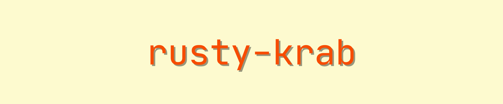

This repository documents my efforts at trying to learn how to program in Rust. 

### Branches
- `trpl` - my notes on *The Rust Programming Language*
- `z2p` - my notes on *Zero to Production in Rust*

### Sources
- [The Rust Programming Language](https://doc.rust-lang.org/book/title-page.html)
- [Zero to Production in Rust](https://www.zero2prod.com/index.html?country_code=US)
